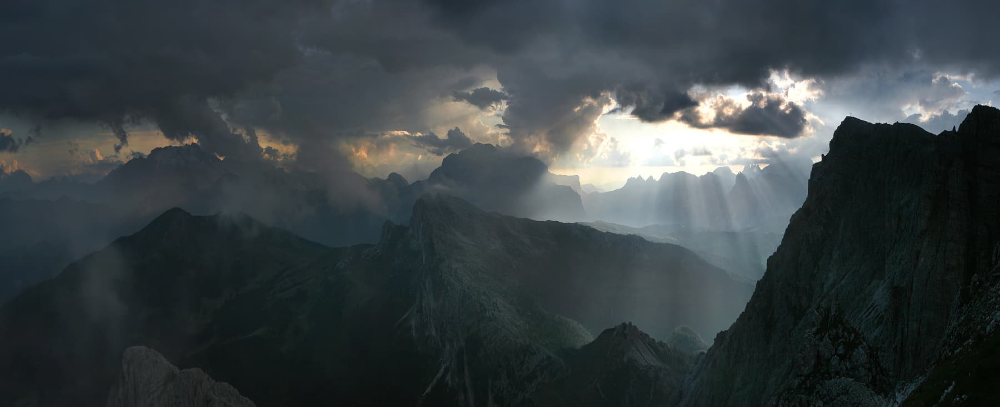

# Место
> Лучшие места со всего мира **[здесь](https://gmvrpw.github.io/russian-travel-bootcamp/)**.
> 

## Что это?

Проект-соцсеть с местами, в которых побывали пользователи.

## Дизайн

[Ссылка на макет в Figma](https://www.figma.com/file/2cn9N9jSkmxD84oJik7xL7/JavaScript.-Sprint-4?node-id=0%3A1)

## Техническая часть

* **Технологии**
    * [HTML5](https://www.w3.org/TR/2011/WD-html5-20110405/)
    * [CSS3](https://www.w3.org/Style/CSS/specs.en.html)
* **Методологии**
    * [BEM](https://en.bem.info/methodology/) 

*Выполнено в рамках курса "Фронтенд разработка". МФТИ 1 курс, 2 семестр*